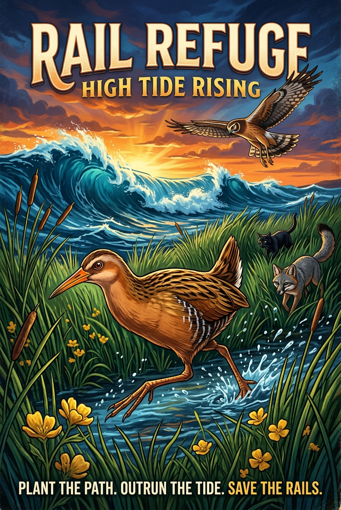

# Rail Refuge: High Tide Rising

<p align="center">
  
</p>

A conservation game about protecting endangered Ridgway's Rails during king tides. Plant vegetation to create hiding spots and guide rails to safety before the tide rises.

## Getting Started

```bash
npm install
npm run dev
```

## Android APK (sideload to tablets)

The game ships as a true native APK via [Capacitor](https://capacitorjs.com/),
wrapping the same `dist/` build the PWA serves. The launcher icons are
generated from the PWA icons (`public/icons/icon-512.png` and
`public/icons/icon-maskable-512.png`), and the activity is locked to
landscape to match the PWA orientation.

Prerequisites: JDK 21 and the Android SDK (`ANDROID_HOME` set).

```bash
npm run android:build
```

This rebuilds the web app, regenerates the launcher icons
(`npm run android:icons`), syncs Capacitor, and runs
`assembleDebug` in `android/`. The sideloadable APK lands at
`android/app/build/outputs/apk/debug/app-debug.apk`
(package `com.railrefuge.hightide`, debug-signed).

Install it on a tablet with `adb install app-debug.apk`, or copy the file
to the tablet and open it (allow "Install unknown apps" when prompted).
Every push to `main` also builds the APK in CI — download it from the
`rail-refuge-debug-apk` artifact on the "Android APK" workflow run.

## License

MIT

## Playing

- Mouse: click to plant. Touch: drag to aim above your finger, then release to plant; drag outside the marsh to cancel.
- The HUD shows seeds, rails still crossing, remaining losses before game over, and an estimated time until the refuge floods. Pause/Resume and reduced-motion controls work on touch screens.
- Waves introduce alternating arrival lanes, paired arrivals, ground hunters, a temporary seed shortage, aerial predators, and the final king tide.
- Shelter circles show usable plant cover. A green line marks a continuous corridor of overlapping circles to the refuge, including vertical spacing.
- Smart Cover awards 25 points per 40 pixels travelled under shelter, capped at 150 per saved rail. Using a connected corridor adds 75 points; using replacement habitat inland of flooded plants adds 25. Total planting count does not reduce these bonuses.

## Verification

Run `npm test` and `npm run build`. With the dev server running on port 3000 and Python Playwright/Chromium installed, `python3 tests/browser_gameplay.py` checks touch gestures, pause/resume, placement feedback, corridor eligibility, and wave transitions.
